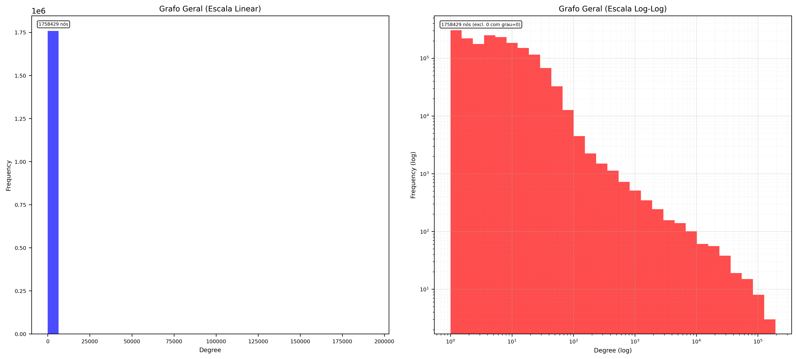

# Análise de Redes de Dependências em Ecossistemas de Software

[](https://github.com/samuelc254/cr-ufabc)
[](https://www.python.org/)
[](LICENSE)

---

## 📖 Visão Geral do Projeto

Este projeto investiga a complexa rede de interdependências em ecossistemas de software *open source*. Utilizando um dataset massivo do **Libraries.io**, modelamos as relações entre mais de **1.7 milhão de pacotes** de software como um grafo direcionado, com o objetivo de identificar os componentes mais críticos e entender a estrutura que sustenta o software moderno.

Através de métricas de redes complexas como grau, PageRank e centralidade de intermediação, revelamos a arquitetura *scale-free* desses ecossistemas, identificamos os pacotes que funcionam como "pilares" da infraestrutura digital e analisamos os riscos sistêmicos associados a falhas nesses componentes centrais.

---

## 👥 Equipe

* **Bruno Rodrigues Lopes de Souza** - `11202321911`
* **Emilly Palhares Melo** - `11202320270`
* **Raquel da Silva Rodrigues** - `11202131327`
* **Samuel Oliveira Costa** - `11202510049`

*Universidade Federal do ABC (UFABC), Santo André, São Paulo, Brasil*

---

## 🎯 Objetivos

* **Geral:** Investigar e modelar a rede de dependências para identificar os pacotes mais centrais e estruturalmente críticos.
* **Específicos:**
    * Extrair e tratar dados de dependência de múltiplos ecossistemas.
    * Representar as relações como grafos direcionados.
    * Calcular e analisar métricas de rede para identificar pacotes-chave.
    * Comparar a estrutura de diferentes plataformas (PyPI, NPM, Maven, etc.).
    * Discutir a resiliência e os riscos associados a falhas em pacotes centrais.

---

## 🛠️ Metodologia e Ferramentas

### Fonte de Dados

* **Dataset:** O estudo utilizou a base de dados completa do **Libraries.io**, obtida através do repositório **Zenodo** (DOI: `10.5281/zenodo.2536573`).
* **Pré-processamento:** O arquivo original (CSV) foi convertido para **Parquet** para otimizar o desempenho durante a manipulação dos dados com Pandas. Foram mantidas apenas as dependências mais recentes de cada pacote para focar a análise na estrutura atual dos ecossistemas.

### Ferramentas Utilizadas

* **Linguagem:** Python 3.11
* **Análise de Dados:** Pandas
* **Modelagem de Rede:** NetworkX
* **Ambiente de Desenvolvimento:** Jupyter Notebook
* **Documentação e Versionamento:** Markdown e GitHub

### Modelagem do Grafo

A rede foi modelada como um **grafo direcionado (DiGraph)**, onde:
* **Nós:** Representam pacotes de software únicos.
* **Arestas:** Representam uma relação de dependência (Pacote A → Pacote B).

O grafo unificado final contém **1.758.429 nós** e **14.078.099 arestas**.

---

## 📊 Principais Resultados e Conclusões

### 1. Uma Rede *Scale-Free* e Centralizada

A análise da distribuição de graus revelou uma estrutura de **rede *scale-free***, caracterizada por uma distribuição de lei de potência (*power-law*). Isso significa que a grande maioria dos pacotes tem pouquíssimas dependências, enquanto um pequeno número de **hubs críticos** concentra dezenas de milhares de conexões.



* Essa estrutura é robusta a falhas aleatórias, mas **extremamente vulnerável** a falhas em seus hubs, como `mocha` e `eslint` no NPM.

### 2. Pacotes Mais Críticos

* **Mais Populares (Maior Grau de Entrada):** `mocha`, `eslint`, `typescript`, `chai` e `webpack` são os pilares do ecossistema, sendo dependências diretas de mais de 100.000 projetos cada.
* **Mais Influentes (PageRank):** Pacotes como `mkdirp` e `mock-fs` possuem alta influência na rede, indicando que são dependências de outros pacotes já muito importantes.
* **Pontes Estruturais (Intermediação):** `rollup` e `webpack` funcionam como pontes cruciais, conectando diferentes comunidades dentro do ecossistema.

### 3. Comparativo entre Plataformas

A análise individual revelou "personalidades" distintas para cada ecossistema:
* **Mais Coeso:** **CRAN (R)**, com apenas 3 componentes desconectados e alta clusterização, formando uma comunidade científica bem integrada.
* **Mais Fragmentado:** **NuGet (.NET)**, com quase 3.000 componentes, mostrando uma rede dispersa e com alta independência entre os projetos.
* **Mais Complexo e Reutilizado:** **NPM (JavaScript)**, com o maior grau médio (21.49), indicando uma cultura de reutilização massiva, mas também uma enorme fragmentação em mais de 5.000 comunidades.

### Conclusão Final

As redes de dependência de software formam estruturas complexas e heterogêneas, cujo funcionamento depende criticamente de um pequeno número de pacotes centrais. A análise de redes se mostrou uma ferramenta essencial para identificar esses pontos de vulnerabilidade, fornecendo subsídios para a criação de políticas de segurança e governança mais eficazes no universo do software livre.

---

## 🚀 Como Executar o Projeto

1.  **Clone o repositório:**
    ```bash
    git clone https://github.com/samuelc254/cr-ufabc.git
    cd cr-ufabc
    ```

2.  **Instale as dependências:**
    ```bash
    pip install pandas pyarrow networkx matplotlib jupyter
    ```

3.  **Execute os Notebooks:**
    Abra e execute os notebooks Jupyter (`.ipynb`) na ordem recomendada para reproduzir a análise:
    * `processDB.ipynb`: Para o tratamento e filtragem inicial dos dados.
    * `main.ipynb`: Para a construção dos grafos e o cálculo das métricas.

---

## 📂 Estrutura do Repositório e Relatórios

* **/reports**: Contém todos os relatórios detalhados da análise, incluindo:
    * `resultado.md`: Um resumo consolidado de todas as métricas por plataforma.
    * `analise_<Plataforma>.md`: Análises individuais para cada um dos 19 ecossistemas.
    * `/json`: Arquivos JSON com as métricas calculadas para cada plataforma.
* **/imgs**: Imagens e gráficos gerados para o relatório final.
* **Relatorio_FINAL_IEEE.pdf**: O documento final completo do projeto, com a discussão aprofundada e todas as referências acadêmicas.

---

## 📜 Licença

Este projeto está licenciado sob a **Licença MIT**. Veja o arquivo [LICENSE](LICENSE) para mais detalhes.
